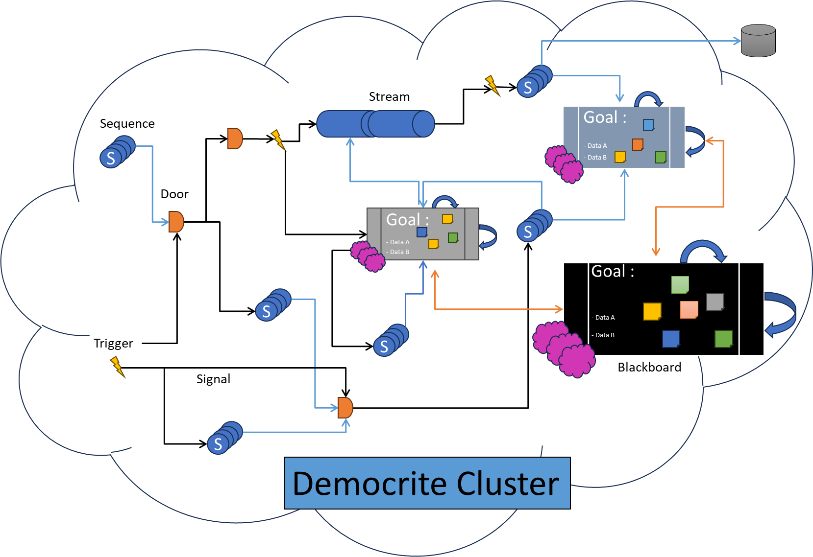

<table style="border:none">
    <tr style="border:none">
        <td style="border:none">
            <image src="docs/logo.png">
        </td>
        <td style="border:none">
            <span style='font-size:112px;valign:center'>Democrite</span>
        </td>
    </tr>
</table>

[](https://www.nuget.org/packages?q=democrite) [](https://github.com/nexai-net/democrite/blob/main/LICENSE) [](https://github.com/nexai-net/democrite/issues?q=is%3Aissue+is%3Aopen+label%3A%22help+wanted%22) [](https://github.com/nexai-net/democrite/issues?q=is%3Aissue+is%3Aopen+label%3A%22good+first+issue%22)

### Democrite is an open-source framework for building robust, scalable and distributed 'multi-agent like' system based on [Microsoft Orleans](https://github.com/dotnet/orleans).

> [!CAUTION]
> The development is still in alpha phase

Democrite offers an automated orchestration and configuration system, enabling dynamic creation, editing, and modification of grain interactions.

It incorporates built-in [Features](#features) to manage virtual grains and facilitate communication between them. This simplifies the creation of various [Sequences](#sequences) of virtual grains that can be transformed an input to output. Democrite utilizes [Signals](#signals) to transmit information and [Triggers](#triggers) to initiate different [Sequences](#sequences), thereby chaining processes through a graph. Most [Features](#features) are describe in a serializable structure.

<p align="center">
    
</p>

Democrite functions as a layer on top of [Microsoft Orleans](https://docs.microsoft.com/dotnet/orleans/), ensuring that all features of Orleans are retained.
- **Scalability** using silo as virtually one server
- **Robustes** through virtual actor model
- **Simplicity** by grain design

All configurations possible with Orleans are still available, but Democrite offers a simplified, fluent configuration model.

[Release Notes](/docs/ReleaseNotes.md)<br />
[Teams](/docs/Team.md)

## Features

### Nodes

A node refers to a server within a cluster.<br />
It is recommended to establish a **client** (server API) along with multiple **nodes** that process requests.<br /> 
This approach enables scaling of the processing component while maintaining a simplified facade.

Democrite node has an individual setup.

```csharp
var node = DemocriteNode.Create((ctx, configBuilder) => configBuilder.AddJsonFile("appsettings.json", false),
                                 cfg =>
                                 {
                                     cfg.WizardConfig()
                                        .ClusterFromConfig()
                                        .ConfigureLogging(c => c.AddConsole());
                                        
                                        ...

                                 });

await using (node)
{
    await node.StartUntilEndAsync();
}

```

> [!TIP]
> [Next](#next) Incomming: **IHostBuilder** integration to allow configuration on existing application.

### Client

A client is a separate program that utilizes the cluster's capabilities.<br /> 
It requires configuration to locate the cluster and send requests.<br /> 
It is advisable to set up the client and the cluster's nodes on different machines.<br />

Democrite client could be setup individually or through existing application setup.

**Individually** <br />

```csharp
var node = DemocriteClient.Create((ctx, configBuilder) => configBuilder.AddJsonFile("appsettings.json", false),
                                   cfg =>
                                   {
                                         cfg.WizardConfig()
                                            .ClusterFromConfig()
                                            .ConfigureLogging(c => c.AddConsole());
                                        
                                        ...

                                     });

await using (node)
{
    await node.StartUntilEndAsync();
}
```

**Integrated**

```csharp
// Add democrite client
builder.Host.UseDemocriteClient(cfg => { ... });
```

### Cluster

Like Orleans, Democrite is build to work in cluster. Client and nodes communicates to each other to solve request.<br />
This solution provide a strong resilience because if one node falldown automatically his work is relocate to other nodes. <br />

To build a cluster you need a way for each new node to discovert the other and share information like status or workload.<br />
Different strategy exist, Orleans choose the [database meeting point](https://learn.microsoft.com/en-us/dotnet/orleans/implementation/cluster-management).

#### Local

When you work in local you just need to configure using (NoCluster) :

```csharp
var node = DemocriteNode.Create(cfg =>
                                {
                                     cfg.WizardConfig()
                                        .NoCluster() // -> Setup the system to only bind to 127.0.0.1 and allow only local client
```                                     

By default, in opposed of Orleans way, the local configuration allow multiple local nodes to form a cluster.<br />
I you want to prevent multiple nodes you have to add the following configuration:

```csharp
var node = DemocriteNode.Create(cfg =>
                                {
                                     cfg.WizardConfig()
                                        .NoCluster() // -> Setup the system to only bind to 127.0.0.1 and allow only local client
                                        .AddEndpointOptions(new ClusterNodeEndPointOptions(loopback: true, siloPort:50000))
```   

#### Mongo

> Nuget package : [Democrite.Framework.Node.Mongo](https://www.nuget.org/packages/Democrite.Framework.Node.Mongo)

You can use mongo db as a **Meeting point**.

To do so you just have configure :

```csharp
var node = DemocriteNode.Create(cfg =>
                                {
                                     cfg.WizardConfig()
                                        // Setup mongo db as cluster meeting point
                                        .UseMongoCluster(m => m.ConnectionString("127.0.0.1:27017"))
```   

Same go for the client part

```csharp
builder.Host.UseDemocriteClient(b =>
                                {
                                    b.WizardConfig()
                                     .UseMongoCluster(m => m.ConnectionString("127.0.0.1:27017"))
```   

> [!IMPORTANT]
> Attention by default a democrite node doesn't allow client to connect to it. (Except in NoCluster configuration use to dev) <br/>
> it's a security to prevent any node to be consumed by client.<br/>
> To enabled the node to be open to client you have two choose:<br/>
> 1) Add manually a gateway port : .**AddEndpointOptions(new ClusterNodeEndPointOptions(gatewayPort: 4242))** // It will conflict if you have multiple node in local
> 2) Let system choose a free port as gateway : .**AddEndpointOptions(new ClusterNodeEndPointOptions(autoGatewayPort: true))**

See the full usage in sample [ExternalStorages/MongoDB](/samples/ExternalStorages/MongoDB/)

### Storages

A Democrite cluster need some information to be stored: <br/>
1) Cluster information (cf. [Cluster](#cluster))
2) VGrain State
3) Reminder clock information
4) Definitions (Sequences, triggers, signal, ...)
5) Custom Data

When you write a VGrain you can inherite from **VGrainBase{TVGrainInterface}** or **VGrainBase{TSTATE, TVGrainInterface}**. <br/>
The second one provide a State management for you. It means the state will be load/create when the VGrain is activate and store when it is desactivate.

> [!TIP]
> In case of crash, the state storage could not be garanty, to prevent this you can call in you code the method "**PushStateAsync**" <br />
> The issue with that is the time consumtion

To store the state you need to provide through the constructor a **IPersistentState{TState}**. <br />
The good practice is to get this instance from dependency injection with tag.

```csharp
        public CounterVGrain(ILogger<ICounterVGrain> logger,
                             [PersistentState("Counter")] IPersistentState<CounterState> persistentState) 
```  

In this example we request a storage place to store a **CounterState** object. <br />
Using the attribute **PersistentStateAttribute** we customize "How" it will be stored. <br />
First parameter is the Storage name (for example the table or collection) and you can specify a second parameter as the **Storage configuration Key**. <br />

> [!TIP]
> You can request by constructor as many storage as you want. <br />
> It's an easy way to managed the data storage

#### Mongo Storage

> Nuget package : [Democrite.Framework.Node.Mongo](https://www.nuget.org/packages/Democrite.Framework.Node.Mongo)

You can use the mongo extension to provide storage for all the components:

- Cluster information -> cf. [Cluster](#mongo)

- Definitions (Sequences, triggers, signal, ...) 
```csharp
    // Define mongo db as definition source
    .AddMongoDefinitionProvider(o => o.ConnectionString("127.0.0.1:27017"))
```  

- State/Custom storage (VGrain State, Reminder clock information, Custom Data)

```csharp
    // Setup mongo db as default storage
    .SetupNodeMemories(m =>
    {
        // Enum StorageTypeEnum provide all sub type
        // You can customize the database name, the connection string ...
        // By default it will reuse the LAST connection string configured
        m.UseMongoStorage(StorageTypeEnum.All); 
    });
```  

See the full usage in sample [ExternalStorages/MongoDB](/samples/ExternalStorages/MongoDB/)

### Virtual Grains (vgrain)

In accordance with Orleans terminology, a grain is a virtual actor that can appear in any compatible silo, with its state being restored if necessary.<br />

In Orleans, to invoke a grain, one must request a proxy instance from the **IGrainFactory**. This proxy seamlessly manages the communication between the caller and the called.
This is why a grain consists of an interface and an implementation, allowing the proxy to inherit the interface.<br />

With Democrite, there is no need to explicitly call the grain yourself, it will do it for you based on the configuration. <br />

This is the reason we refer to them as **Virtual Grains** (**VGrain**), to denote a behavior that prevent direct call consumption.

### Sequences

A **Sequence** is a series of virtual grains executed sequentially, where the output of one can be used as input for the next **VGrain**. <br />

The aim is to set up this sequence description just once and save it in a database. To run the sequence, only its unique identifier (**Uid**) is required.

> [!IMPORTANT]
> Currently, only local declarations are supported.
> Please refer to the [Next](#next) section for information on future capabilities to load these configurations from a storage system, such as databases.

To configure and test **sequences** you need to create and register it in the DemocriteNode configuration.

**Build definition**
```csharp
var collectorSequence = Sequence.Build()
                                // Ask a web URI in input
                                .RequiredInput<Uri>()

                                // Fetch html page and return it
                                .Use<IHtmlCollectorVGrain>().Call((a, url, ctx) => a.FetchPageAsync(url, ctx)).Return

                                // Configure inspector on specific pair inspect and extract current value
                                .Use<IPriceInspectorVGrain>().Configure(currencyPair)
                                                             .Call((a, page, ctx) => a.SearchValueAsync(page, ctx)).Return

                                // Store the value received into a dedicated statefull grain
                                .Use<ICurrencyPairVGrain>().Configure(currencyPair)
                                                           .Call((a, data, ctx) => a.StoreAsync(data, ctx)).Return
                                .Build();
```

**Register definition**
```csharp
var node = DemocriteNode.Create((ctx, configBuilder) => configBuilder.AddJsonFile("appsettings.json", false),
                                 cfg =>
                                 {
                                     cfg.WizardConfig()
                                        .NoCluster()

                                        .ConfigureLogging(c => c.AddConsole())

                                        .AddInMemoryMongoDefinitionProvider(m =>
                                        {
                                            // Local in node memory setup
                                            .SetupSequences(collectorSequence);
                                        })
```

### Triggers

A **Sequences** can be executed manually, but it can also be triggered automatically.

There are differents kind of **triggers** :
- **Time Periodicity**, use a cron expression to define the periodicity
- **Signals**, trigge when configured signal is also fire

Similar to **sequences**, trigger definitions can currently be created and stored locally, with plans for future storage in external sources like databases.

> [!IMPORTANT]
> Currently, only local declarations are handled.
> The upcoming goal, detailed in the [Next](#next) section, is to enable loading these configurations from a storage source.

A trigger can supply an input to initiate the sequence.

> [!IMPORTANT]
> Currently, only static data collection is supported.
> Please see the [Next](#next) section for information on the future goal of loading these configurations from an external provider.

**Time Periodicity** <br />
```csharp
                               // Every minutes between 9h and 18h UTC between monday and friday
var triggerDefinition = Trigger.Cron("* 9-18 * * mon-fri") 
                               
                               // Define what will be trigged (Sequence or signals)
                               .AddTarget(collectorSequence)

                               // You could have many target or many types

                               //.AddTarget(collectorSequence2)
                               //.AddTarget(collectorSequence3)

                               // Define how to get input information that will be send to targets
                               .SetInputSource(input => input.StaticCollection(collectionsources)
                                                             .PullMode(PullModeEnum.Circling)
                                                             .Build())
                               .Build();
```

**Signals**
```csharp
                                    // listen inputSignal and trigger when this one is fire
var signalTriggerDefinition = Trigger.Signal(inputSignal)

                                    // Define what will be trigged
                                    .AddTargetSequence(collectorSequence)

                                    .SetInputSource(input => input.StaticCollection(collectionsources)
                                                                    .PullMode(PullModeEnum.Circling)
                                                                    .Build())
                                    .Build();
```

**Register definition**
```csharp
var node = DemocriteNode.Create((ctx, configBuilder) => configBuilder.AddJsonFile("appsettings.json", false),
                                 cfg =>
                                 {
                                     cfg.WizardConfig()
                                        .NoCluster()

                                        .ConfigureLogging(c => c.AddConsole())

                                        .AddInMemoryMongoDefinitionProvider(m =>
                                        {
                                            // Local in node memory setup
                                            m.SetupTriggers(signalTriggerDefinition);
                                        })
```

### Stream

Use an EBS (Entreprise Bus Service) as storage an diffuseur of job to to.

Orlean can nativaly used different type of **ESB**. <br /> 
With Democrite we create connector through trigger to push and pull.

Send to stream :
```csharp
// PUSH
var trigger = Trigger.Cron("*/25 * * * * *", "TGR: Push Every 25 sec")
                     
                     .AddTargetStream(streamDef) // <----- Add stream as target

                     .SetOutput(s => s.StaticCollection(Enumerable.Range(0, 50))
                                            .PullMode(PullModeEnum.Broadcast))
                     .Build();

```

Consume from stream :
```csharp
// PUSH
var fromStreamTrigger = Trigger.Stream(streamDef) // <----- Trigger that fire until theire is a message in the stream queue
                               .AddTargetSequence(consumeSeq.Uid)

                               // Limit the number of concurrent execution, Prevent consuming all messages without resources in the cluster to process them (CPU, RAM, ...)
                               .MaxConcurrentProcess(2)

                               .Build();

```

### Signals

The signals feature consists of two components:
- **Signal**
- **Door**

A **signal** functions similarly to an event, but with a **"fire and forget"** approach.<br />

By default, the signal includes:
- Definition name & Uid
- The VGrain information that fire
- The datetime when it is fire
- The possible previous signal that cause this one to fire

However, it can carry a small amount of information. <br />
It is recommended to keep this information as minimal as possible to avoid memory issues.<br />
It could be something as simple as an ID referencing data in storage.

Define a **signal**:
```csharp
var signalA = Signal.Create("signalA");
```
<br />
<br />

A **Door** can listen to multiple **signals** and, based on specific conditions, can emit its own **signal**. 

Currently, a boolean logic door is available, but you can easily create and configure your own gate logic.

Define a **Logic boolean door**:
```csharp
 var door = Door.Create("CheckPairAboveAverage")
                .Listen(valueEurUsdStoredAboveAverage, valueEurChfStoredAboveAverage)

                // Basic
                // Fire If (A & B) are fired in a 10 sec window
                // By default the door unlock as soon as the condition is valid and 
                // signal activation are only use one.
                .UseLogicalAggregator(LogicEnum.And, TimeSpan.FromSeconds(10))

                // Advanced
                //.UseLogicalAggregator(b =>
                //{
                //    return b.Interval(TimeSpan.FromSeconds(0.5))
                //            .AssignVariableName("A", valueEurUsdStoredAboveAverage)
                //            .AssignVariableName("B", valueEurChfStoredAboveAverage)
                //            .AssignVariableName("C", manualForceDoorFireing)

                //            /* Fire (if A and B are signal in an interval of 0.5 second except if i was already fire in less than 0.5 seconds)
                //                    Or
                //                    C
                //             */
                //            .Formula("(A & B & !this) | C");
                //})
                .Build();
```

#### Door Types
- **LogicalAggregator** : Apply a boolean condition based on signal activation (1 if activate on period of time, otherwise 0)
- **RelayFilterDoor**: Apply a condition a the signal structure itself, use a filter to trigger specific sequence

**Register definition**
```csharp
var node = DemocriteNode.Create((ctx, configBuilder) => configBuilder.AddJsonFile("appsettings.json", false),
                                 cfg =>
                                 {
                                     cfg.WizardConfig()
                                        .NoCluster()

                                        .ConfigureLogging(c => c.AddConsole())

                                        .AddInMemoryMongoDefinitionProvider(m =>
                                        {
                                            // Local in node memory setup
                                            m.SetupSignals(t => t.Register(signalA))
                                             .SetupDoors(t => t.Register(door));
                                        })
```

### Virtual Grain Id

In the Orleans framework, a grain definition can have multiple virtual instances.<br /> 
However, only **one** instance is active at any given time, associated with a unique identifier known as a  [GrainId](https://learn.microsoft.com/en-us/dotnet/orleans/grains/grain-identity).<br/>

In Orleans, it is the user's responsibility to supply the correct GrainId of the grain they wish to call. 

In Democrite, virtual grains are instantiated and called by a generic orchestrator. <br />
By default, a new Guid is used each time, which is ideal for [stateless grain](https://learn.microsoft.com/en-us/dotnet/orleans/grains/stateless-worker-grains). <br />

[Virutal Grain](#virtual-grains) interface could be tag by attribute [VGrainIdFormatAttribute](/src/Frameworks/Democrite.Framework.Core.Abstractions/Attributes/VGrainIdFormatAttribute.cs) to indicate how to build the [GrainId](https://learn.microsoft.com/en-us/dotnet/orleans/grains/grain-identity).

The template ID system provides the ability to dynamically create a [GrainId](https://learn.microsoft.com/en-us/dotnet/orleans/grains/grain-identity) using data input or execution context as the source of information.

You can see a good example in the sample [Forex](#forex). <br/>
This one use stateless virtual grain (vgrain) to download html page and parse it<br /> 
but use a statefull virtual grain (vgrain) to store the value extracted.<br />

This virtual grain (vgrain) employs a string value, such as a forex pair (eur-usd, eur-chf, etc.), from the execution context to form its GrainId, resulting in the creation of a single reusable instance for each pair

This allow :
- A client to directly call this vgrain to extract the values.
- To create only one grain by pair that is single-thread handled by orleans (no need to think of concurrent access)
- Store information in dedicate a serializable model in class and not to focus on the storage mode (databases, files, ...)

> [!TIP]
> You can access those grain usign the classic orleans [IGrainFactory]() way. <br />
> **BUT** it is better to use [IDemocriteExecutionHandler](#consume-democrite-cluster) who will use correctly and automatically the correct GrainId.

### External Code VGrain

With Democrite we can use other satellite program or script to perform jobs.<br />

To do so you need simple steps:
- Create Code artifact definitions
- Using through a vgrain
    - Use generic vgrain in the library **IGenericArtifactExecutableVGrain**
    - Create your own vgrain by inherite from **ArtifactExecutableBaseVGrain<>** instead of **VGrainBase**

#### Python

A python package exist to handle the communication protocol with democrite [README.md](/src/Extensions/Dist/Python/README.md) <br />
You can found a full sample [Here](/samples/PythonVGrains/) <br />

### Blackboard

A blackboard is a temporary shared space with specific controllers to solve a problem. <br />
The goal is to group specific analyze result and have controllers deciding the next step to acheived to a solution.

You can found a full sample [Here](/samples/Blackboard/) <br />

## Quick Start

### Nuget Packages

> [!IMPORTANT]
> For now democrite is in alpha version.
> Don't forget to use the pre-release flag in visual studio

[](https://www.nuget.org/packages?q=democrite)

- **Democrite.Framework.Node**: Reference this one by your node project.
- **Democrite.Framework.Client**: Reference this one by your client project.
- **Democrite.Framework.Builder**: Reference this one by your project that build definitions.

If you split the agent implementation and definition in separate projet you could only reference the nuget package **Democrite.Framework.Core**

**Framework Feature**
- **Democrite.Framework.Node.Cron**: Reference this one by your node project to enable the cron mechanism.
- **Democrite.Framework.Node.Signals**: Reference this one by your node project to enable the signals mechanism.
- **Democrite.Framework.Node.StreamQueue**: Reference this one by your node project to enable the stream mechanism.
- **Democrite.Framework.Node.Blackboard**: Reference this one by your node project to enable the stream mechanism.

**Extensions**
- **Democrite.Framework.Extensions.Mongo**: Reference this one by your node project to enable the mongo db Storage.

**Bags**
- **Democrite.Framework.Bag.DebugTools**: Reference this one by your node project to enable debug sequences or VGrain (Like Display, ...).
- **Democrite.Framework.Bag.Toolbox**: Reference this one by your node project to enable basic tools sequences or VGrain (like delay, ...).

### Node

To create a node you just have to follow the example bellow.

> [!CAUTION]
> Orleans scan by default all the project dll.
> Due to .net assembly load behavior if you deport your agent implementation in another projet is may not be loaded if you don't directly use any of the type defined. Reference the project is not enough.
> In the [Next](#next) section you will see an objectif to reference assembly to load for now you have to use the SetupVGrains method in the wizard configurator.

In Program.cs:

```csharp
var node = DemocriteNode.Create((ctx, configBuilder) => configBuilder.AddJsonFile("appsettings.json", false),
                                   cfg =>
                                   {
                                         cfg.WizardConfig()
                                            .ClusterFromConfig()
                                            .Configure(b => b.ConfigureLogging(logging => logging.AddConsole()));
                                        
                                        ...

                                     });

await using (node)
{
    await node.StartUntilEndAsync();
}
```

### Client

To create a client you just have to follow the example bellow.

> [!CAUTION]
> All nodes and clients need a **meeting point** to know the others and form a cluster, orleans choose the database strategy.
> By default only one node and one client could be present on the same machine wihtout any db setup.
> But You could use the orleans fluent method to configure your cluster and client.
> You can now use different database solution for all storage type look for [#Cluster](#cluster) section

In Program.cs:

```csharp
var node = DemocriteClient.Create((ctx, configBuilder) => configBuilder.AddJsonFile("appsettings.json", false),
                                   cfg =>
                                   {
                                         cfg.WizardConfig()
                                            .ClusterFromConfig()
                                            .Configure(b => b.ConfigureLogging(logging => logging.AddConsole()));
                                        
                                        ...

                                     });

await using (node)
{
    await node.StartUntilEndAsync();
}
```

### Consume Democrite Cluster

To execute a sequence or call a specific grain you have to use the service [IDemocriteExecutionHandler](/src/Frameworks/Democrite.Framework.Core.Abstractions/IDemocriteExecutionHandler.cs).

This handler follow democrite rules in grain id generation.

### Tips

1. Normalize your data model and create small [Virtual Grain](#virtual-grains) with small sponsability.
2. Follow the [SRP](https://en.wikipedia.org/wiki/Single_responsibility_principle) (Single Repsonsability Principle) as describe in the [S.O.L.I.D pattern](https://en.wikipedia.org/wiki/SOLID)
3. If you attach information to **signal** use small one like simple id.
4. Prefer democrite configuration if possible to prevent any side effect non managed

## Samples

### Forex

In the section [Sample/Forex](/samples/Forex/)

**Use case**

Fetch reguraly a forex pair value using public web site, store the values and be able to consume them through an api.

**Features Use**
- Democrite [sequence](#sequences) definition
- Democrite [Cron Trigger](#triggers) definition
- Democrite automatic [Virtual Grain Id](#virtual-grain-id)
- [Orleans persistant state](https://learn.microsoft.com/en-us/dotnet/orleans/grains/grain-persistence/?pivots=orleans-7-0)
- [Minimal .net API](https://learn.microsoft.com/en-us/aspnet/core/tutorials/min-web-api?view=aspnetcore-8.0&tabs=visual-studio)
- Democrite client [IDemocriteHandler](#consume-democrite-cluster) usage


### External Storage

**Use case**

Create a node cluster with a client connected through external storage.
In storage we will also store definitions of a trigger that will every minute increment a counter tag with a name.
Through the client you can look for the counter value through a swagger api

**Features Use**
- Democrite [sequence](#sequences) definition
- Democrite [Cron Trigger](#triggers) definition
- Democrite automatic [Virtual Grain Id](#virtual-grain-id)
- Storage:
    - Cluster information (client/node)
    - Definitions
    - Reminder informations
- [Orleans persistant state](https://learn.microsoft.com/en-us/dotnet/orleans/grains/grain-persistence/?pivots=orleans-7-0)
- [Minimal .net API](https://learn.microsoft.com/en-us/aspnet/core/tutorials/min-web-api?view=aspnetcore-8.0&tabs=visual-studio)
- Democrite client [IDemocriteHandler](#consume-democrite-cluster) usage

**Mongo**<br />
In the section [samples/ExternalStorages/MongoDB](/samples/ExternalStorages/MongoDB/)

### Relay Filter Door

In the section [Sample/RelayFilterDoor](/samples/RelayFilterDoor/)

**Use case**

Relay filter door can apply a condition on signal received.
For example if the signal transport a value of type int i let pass.

**Features Use**
- Democrite RelayFilterDoor definition

### PyhtonVGrains

In the section [Sample/PythonVGrains](/samples/PythonVGrains/)

**Use case**

Use Python scripts inside democrite environment like VGrain standard

> [!CAUTION]
> In version 0.2.2 only local python script deployed with the democrite node as 'Content' is supported <br />
> You goal is to be able to support different package provider, <br/>
> in different format late on. (From api, zip, shared folder, resource embedded ...)

**Features Use**
- Democrite Artifact Definition, Packaging
- External code executor (allow democrite to used external program as solver)

## Next

(Processing) v 0.3.1-prerelease :

- [ ] Add method to reference the vgrain assembly in the system to be sure this one is loaded by orleans.
- [ ] Force grain redirection for a precise sequence execution
- [ ] Call sequence from sequence
- [ ] Create sequence definition in runtime
- [ ] Condition stage to execute different stages base on a simple condition

**v 0.3-prerelease:** <br/>
[Release Node](/docs/ReleaseNotes.md#03-prerelease)
- [x] **Blackboard** extensions
- [x] Create bags as container of generic (toolbox, debug)
- [x] **Repository** : global & simple storage system not linked to a grain state
- [x] Process through a **foreach** a sub properties collection in a sequence
- [x] Trigger use to push or pull data from a **stream**
- [x] Fire signal from **sequence**

**v 0.2.2-prerelease:** <br />
[Release Node](/docs/ReleaseNotes.md#022-prerelease)
- [x] Fully integrate **Python** VGrain in Democrite environment

**v 0.2.1-prerelease:** <br />
[Release Note](/docs/ReleaseNotes.md#021-prerelease)

- [x] Easy cluster external storage to store virtual grain state, reminder, membership ...
- [x] **IHostBuilder** integration to allow configuration on existing application.
- [x] Load **Definition**, sequence, signals, triggers, ... from an external source like databases using the design pattern strategy through IProviderSource

## Versions

| Democrite Version | Minimal .net version | Minimal orlean version |
| --- | --- | --- |
| Lastest | .net 7.0 | 7.2.4 |
| 0.2.1 | .net 7.0 | 7.0.3 |


## References
- [Microsoft Orleans](https://github.com/dotnet/orleans)
- [Microsoft Orleans: Documentation](https://docs.microsoft.com/dotnet/orleans/)
- [Nexai Community](https://www.nexai-community.net/)
