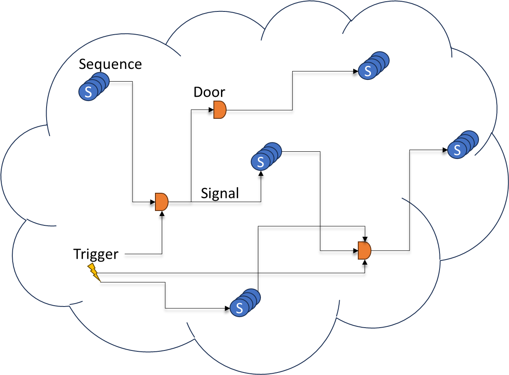

<table>
    <tr>
        <td>
            <image src="docs/logo.png">
        </td>
        <td>
            <span style='font-size:112px;valign:center'>Democrite</span>
        </td>
    </tr>
</table>

[](https://github.com/nexai-net/democrite/releases) [](https://github.com/nexai-net/democrite/blob/main/LICENSE) [](https://github.com/nexai-net/democrite/issues?q=is%3Aissue+is%3Aopen+label%3A%22help+wanted%22) [](https://github.com/nexai-net/democrite/issues?q=is%3Aissue+is%3Aopen+label%3A%22good+first+issue%22)

### Democrite is an open-source framework for building robust, scalable and distributed 'multi-agent like' system base on [Microsoft Orleans](https://github.com/dotnet/orleans).

> [!IMPORTANT]
> The development is still in alpha phase

Democrite provide an automatic orchestration & configuration system to be able to dynamicly create, edit and modify grain interactions.

Democrite use build-in [Features](#features) to managed virtual grains and communication between them using mainly serializable descriptions.
This allow to create easily different [Sequences](#sequences) of vgrains that transform into input to output. Using [Signals](#signals) to send information and [Triggers](#triggers) differents [Sequences](#sequences), chain the treatment through a graph.

<p align="center">
    
</p>

Democrite is a layer above [Microsoft Orleans](https://docs.microsoft.com/dotnet/orleans/) that means all the feature of orleans remains.
- **Scalability** using silo as virtually one server
- **Robustes** through virtual actor model
- **Simplicity** by grain design

All orleans configuration remains possible however a simplify fluent configuration model is provide by democrite.

[Release Notes](/docs/ReleaseNotes.md)<br />
[Teams](/docs/Team.md)

## Features

### Nodes

A node is a server in a cluster. <br />
We advise to create a **client** (server API) and multiples **node** that process the request. <br />
This allow to scale the process part and remain a simple facade part.

Democrite node has an individual setup.

```csharp
var node = DemocriteNode.Create((ctx, configBuilder) => configBuilder.AddJsonFile("appsettings.json", false),
                                 cfg =>
                                 {
                                     cfg.WizardConfig()
                                        .ClusterFromConfig()
                                        .Configure(b => b.ConfigureLogging(logging => logging.AddConsole()));
                                        
                                        ...

                                 });

await using (node)
{
    await node.StartUntilEndAsync();
}

```

> [!TIP]
> [Next](#next) Incomming: **IHostBuilder** integration to allow configuration on existing application.

### Client

A client is another program that consume the cluster capabilities. <br />
This one need configuration to found the cluster and send request. <br />
We advise to create a client and cluster's node on different machines. <br />

Democrite client could be setup individually or through existing application setup.

**Individually** <br />

```csharp
var node = DemocriteClient.Create((ctx, configBuilder) => configBuilder.AddJsonFile("appsettings.json", false),
                                   cfg =>
                                   {
                                         cfg.WizardConfig()
                                            .ClusterFromConfig()
                                            .Configure(b => b.ConfigureLogging(logging => logging.AddConsole()));
                                        
                                        ...

                                     });

await using (node)
{
    await node.StartUntilEndAsync();
}
```

**Integrated**

```csharp
// Add democrite client
builder.Host.UseDemocriteClient(cfg => { ... });
```

### Virtual Grains

Following the terminalogie of Orleans a grain is virtual actor that could pop on any compatible silo with his state restore if necessary. <br />
In orleans to call a grain you have to ask a proxy instance to the **IGrainFactory**. This proxy will transparently managed the communication between call and caller. <br />
That why a grain is composed of an interface and implementation to allow proxy to inherite the interface.

Through democrite you doesn't need to call specificly the grain youself democrite will do it for you based on the configuration. <br />

That why we use the name of **Virtual Grains** (**VGrain**) to specify a 'not direct call consumation' behavior.

### Sequences

A **Sequence** is a chain of virtual grain that will be executed one after the other sequentially where output could be consumed as input by the next **VGrain**. <br />

The goal is to define this sequence only once and store it in a database.
To execute the sequence only its **Uid** is needed.

> [!IMPORTANT]
> For now only local declaration is managed.
> Look to [Next](#next) section to see that future behavior to load those configuration from a storage system (Databases).

To configure and test **sequences** you need to create and register it in the DemocriteNode configuration.

**Build definition**
```csharp
var collectorSequence = Sequence.Create()
                                // Ask a web URI in input
                                .RequiredInput<Uri>()

                                // Fetch html page and return it
                                .Use<IHtmlCollectorVGrain>().Call((a, url, ctx) => a.FetchPageAsync(url, ctx)).Return

                                // Configure inspector on specific pair inspect and extract current value
                                .Use<IPriceInspectorVGrain>().Configure(currencyPair)
                                                             .Call((a, page, ctx) => a.SearchValueAsync(page, ctx)).Return

                                // Store the value received into a dedicated statefull grain
                                .Use<ICurrencyPairVGrain>().Configure(currencyPair)
                                                           .Call((a, data, ctx) => a.StoreAsync(data, ctx)).Return
                                .Build();
```

**Register definition**
```csharp
var node = DemocriteNode.Create((ctx, configBuilder) => configBuilder.AddJsonFile("appsettings.json", false),
                                 cfg =>
                                 {
                                     cfg.WizardConfig()
                                        .NoCluster()

                                        .Configure(b => b.ConfigureLogging(logging => logging.AddConsole()))

                                        .SetupInMemoryDefintions(m =>
                                        {
                                            // Local in node memory setup
                                            .SetupSequences(c => c.Register(collectorSequence));
                                        })
```

### Triggers

A **Sequences** could be executed manually but also automatic by triggers.

There are differents kind of **triggers** :
- **Time Periodicity**, use a cron expression to define the periodicity
- **Signals**, trigge when configured signal also fire

Like the **sequences**, trigger definition could be created and store locally or in the near future in external source like databases.

> [!IMPORTANT]
> For now only local declaration is managed.
> Look to [Next](#next) section to see that next goal is to load those configurations from a storage source.

A trigger could provide a input to the sequence start.

> [!IMPORTANT]
> For now only static data collection is managed.
> Look to [Next](#next) section to see that next goal is to load those configuration from a external provider.

**Time Periodicity** <br />
```csharp
                               // Every minutes between 9h and 18h UTC between monday and friday
var triggerDefinition = Trigger.Cron("* 9-18 * * mon-fri") 
                               
                               // Define what will be trigged (Sequence or signals)
                               .AddTarget(collectorSequence)

                               // You could have many target or many types

                               //.AddTarget(collectorSequence2)
                               //.AddTarget(collectorSequence3)

                               // Define how to get input information that will be send to targets
                               .SetInputSource(input => input.StaticCollection(collectionsources)
                                                             .PullMode(PullModeEnum.Circling)
                                                             .Build())
                               .Build();
```

**Signals**
```csharp
                                    // listen inputSignal and trigger when this one is fire
var signalTriggerDefinition = Trigger.Signal(inputSignal)

                                    // Define what will be trigged
                                    .AddTarget(collectorSequence)

                                    .SetInputSource(input => input.StaticCollection(collectionsources)
                                                                    .PullMode(PullModeEnum.Circling)
                                                                    .Build())
                                    .Build();
```

**Register definition**
```csharp
var node = DemocriteNode.Create((ctx, configBuilder) => configBuilder.AddJsonFile("appsettings.json", false),
                                 cfg =>
                                 {
                                     cfg.WizardConfig()
                                        .NoCluster()

                                        .Configure(b => b.ConfigureLogging(logging => logging.AddConsole()))

                                        .SetupInMemoryDefintions(m =>
                                        {
                                            // Local in node memory setup
                                            m.SetupTriggers(t => t.Register(signalTriggerDefinition));
                                        })
```

### Signals

The signals feature is compose of two elements:
- **Signal**
- **Door**

A **signal** is like an event except it is **"fire and forget"**. <br />

By default the signal carry:
- Definition name & Uid
- The VGrain information that fire
- The possible previous signal that cause this one to fire

But you can get small information to carry. <br />
We advise to keep it as small as possible to prevent memory issue. <br />
It could a simple id to of data in the storage.

Define a **signal**:
```csharp
var signalA = Signal.Create("signalA");
```
<br />
<br />

A **Door** could listen multiples **signals** and based on specific condition could fire is own **signal**.

For know a boolean logic door is provided but you can easily create and setup you own gate logic.

Define a **Logic boolean door**:
```csharp
 var door = Door.Create("CheckPairAboveAverage")
                .Listen(valueEurUsdStoredAboveAverage, valueEurChfStoredAboveAverage)

                // Basic
                // Fire If (A & B) are fired in a 10 sec window
                // By default the door unlock as soon as the condition is valid and 
                // signal activation are only use one.
                .UseLogicalAggregator(LogicEnum.And, TimeSpan.FromSeconds(10))

                // Advanced
                //.UseLogicalAggregator(b =>
                //{
                //    return b.Interval(TimeSpan.FromSeconds(0.5))
                //            .AssignVariableName("A", valueEurUsdStoredAboveAverage)
                //            .AssignVariableName("B", valueEurChfStoredAboveAverage)
                //            .AssignVariableName("C", manualForceDoorFireing)

                //            /* Fire (if A and B are signal in an interval of 0.5 second except if i was already fire in less than 0.5 seconds)
                //                    Or
                //                    C
                //             */
                //            .Formula("(A & B & !this) | C");
                //})
                .Build();
```

**Register definition**
```csharp
var node = DemocriteNode.Create((ctx, configBuilder) => configBuilder.AddJsonFile("appsettings.json", false),
                                 cfg =>
                                 {
                                     cfg.WizardConfig()
                                        .NoCluster()

                                        .Configure(b => b.ConfigureLogging(logging => logging.AddConsole()))

                                        .SetupInMemoryDefintions(m =>
                                        {
                                            // Local in node memory setup
                                            m.SetupSignals(t => t.Register(signalA))
                                             .SetupDoors(t => t.Register(door));
                                        })
```

### Virtual Grain Id

In orleans vision a grain could have multiple virtual instances. <br/>
Only **one** instance is alive at the time associate to identifier a [GrainId](https://learn.microsoft.com/en-us/dotnet/orleans/grains/grain-identity).<br/>

In orleans is the user responsability to provide the correct GrainId of the grain you want to call.

In democrite virtual grain are instanciate and call by a generic orchestrator. <br />
By default a new Guid is used each time. <br />
Ideal for the [stateless grain](https://learn.microsoft.com/en-us/dotnet/orleans/grains/stateless-worker-grains).<br />

[Virutal Grain](#virtual-grains) interface could be tag by attribute [VGrainIdFormatAttribute](/src/Frameworks/Democrite.Framework.Core.Abstractions/Attributes/VGrainIdFormatAttribute.cs) to indicate how to build the [GrainId](https://learn.microsoft.com/en-us/dotnet/orleans/grains/grain-identity).

The template id system offer opportunities to create dynamically a [GrainId](https://learn.microsoft.com/en-us/dotnet/orleans/grains/grain-identity) using data input or execution context as information source.

You can see a good example in the sample [Forex](#forex). <br/>
This one use stateless vgrain to download html page and to parse it<br /> 
but use a statefull vgrain to store the value extracted.<br />

This vgrain use a string value in the execution context, forex pair (eur-usd, eur-chf, ...) to create is GrainId.
Creating on reusable instance by pair-

This allow :
- A client to directly call this vgrain to extract the values.
- To create only one grain by pair that is single-thread handled by orleans (no need to think of concurrent access)
- Store information in dedicate a serializable model in class and not to focus on the storage mode (databases, files, ...)

> [!IMPORTANT]
> You can access those grain usign the classic orleans [IGrainFactory]() way. <br />
> **BUT** it is better to use [IDemocriteExecutionHandler](#consume-democrite-cluster) who will use correctly and automatically the correct GrainId.

## Quick Start

### Nuget Packages

> [!IMPORTANT]
> For now democrite is in alpha version.
> Don't forget to use the pre-release flag in visual studio

[](https://www.nuget.org/packages?q=democrite)

- **Democrite.Framework.Node**: Reference this one by your node project.
- **Democrite.Framework.Client**: Reference this one by your client project.
- **Democrite.Framework.Builder**: Reference this one by your project that build definitions.

If you split the agent implementation and definition in separate projet you could only reference the nuget package **Democrite.Framework.Core**

**Extensions**
- **Democrite.Framework.Node.Cron**: Reference this one by your node project to enable the cron mechanism.
- **Democrite.Framework.Node.Signals**: Reference this one by your node project to enable the signals mechanism.

### Node

To create a node you just have to follow the example bellow.

> [!IMPORTANT]
> Orleans scan by default all the project dll.
> Due to .net assembly load behavior if you deport your agent implementation in another projet is may not be loaded if you don't directly use any of the type defined. Reference the project is not enough.
> In the [Next](#next) section you will see an objectif to reference assembly to load for now you have to use the SetupAgents method in the wizard configurator.

In Program.cs:

```csharp
var node = DemocriteNode.Create((ctx, configBuilder) => configBuilder.AddJsonFile("appsettings.json", false),
                                   cfg =>
                                   {
                                         cfg.WizardConfig()
                                            .ClusterFromConfig()
                                            .Configure(b => b.ConfigureLogging(logging => logging.AddConsole()));
                                        
                                        ...

                                     });

await using (node)
{
    await node.StartUntilEndAsync();
}
```

### Client

To create a client you just have to follow the example bellow.

> [!IMPORTANT]
> All nodes and clients need a **meeting point** to know the others and form a cluster, orleans choose the database strategy.
> By default only one node and one client could be present on the same machine wihtout any db setup.
> But You could use the orleans fluent method to configure your cluster and client.
> A simple way will be added in democrite late on.

In Program.cs:

```csharp
var node = DemocriteClient.Create((ctx, configBuilder) => configBuilder.AddJsonFile("appsettings.json", false),
                                   cfg =>
                                   {
                                         cfg.WizardConfig()
                                            .ClusterFromConfig()
                                            .Configure(b => b.ConfigureLogging(logging => logging.AddConsole()));
                                        
                                        ...

                                     });

await using (node)
{
    await node.StartUntilEndAsync();
}
```

### Consume Democrite Cluster

To execute a sequence or call a specific grain you have to use the service [IDemocriteExecutionHandler](/src/Frameworks/Democrite.Framework.Core.Abstractions/IDemocriteExecutionHandler.cs).

This handler follow democrite rules in grain id generation.

### Tips

1. Normalize your data model and create small [Virtual Grain](#virtual-grains) with small sponsability.
2. Follow the [SRP](https://en.wikipedia.org/wiki/Single_responsibility_principle) (Single Repsonsability Principle) as describe in the [S.O.L.I.D pattern](https://en.wikipedia.org/wiki/SOLID)
3. If you attach information to **signal** use small one like simple id.
4. Prefer democrite configuration if possible to prevent any side effect non managed

## Samples

### Forex

In the section [Sample/Forex](/samples/Forex/)

> [!IMPORTANT]
> To execute this sample you will need all the code, use the **Democrite.sln** <br />
> Later on the sample will be isolated with nuget reference

**Use case**

Fetch reguraly a forex pair value using public web site, store the values and be able to consume them through an api.

**Features Use**
- Democrite [sequence](#sequences) definition
- Democrite [Cron Trigger](#triggers) definition
- Democrite automatic [Virtual Grain Id](#virtual-grain-id)
- [Orleans persistant state](https://learn.microsoft.com/en-us/dotnet/orleans/grains/grain-persistence/?pivots=orleans-7-0)
- [Minimal .net API](https://learn.microsoft.com/en-us/aspnet/core/tutorials/min-web-api?view=aspnetcore-8.0&tabs=visual-studio)
- Democrite client [IDemocriteHandler](#consume-democrite-cluster) usage


### Logical Tree

TBD

## Next

v 0.2.1-prerelease :

- [ ] Easy cluster external storage to store virtual grain state, reminder, membership ...
- [ ] **IHostBuilder** integration to allow configuration on existing application.
- [ ] Load **Definition**, sequence, signals, triggers, ... from an external source like databases using the design pattern strategy through IProviderSource
- [ ] Configure trigger input source from an external service (support of pick mode)
- [ ] Add method to reference the agent assembly in the system to be sure this one is loaded by orleans.

## Versions

| Democrite Version | Minimal .net version | Minimal orlean version |
| --- | --- | --- |
| Lastest | .net 7.0 | 7.0.3 |


## References
- [Microsoft Orleans](https://github.com/dotnet/orleans)
- [Microsoft Orleans: Documentation](https://docs.microsoft.com/dotnet/orleans/)
- [Nexai Community](https://www.nexai-community.net/)
